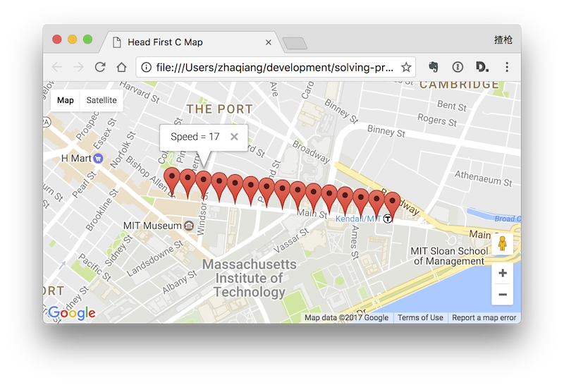
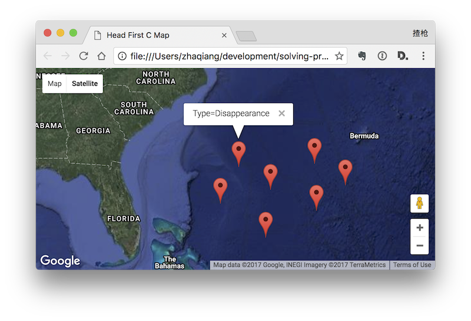

## Compile

    $ gcc bermuda.c -o bermuda
    $ gcc geo2json.c -o geo2json
    
## Execute

    $ ./geo2json < gpsdta.csv > output.json
    $ (./bermuda | ./geo2json) < spooky.csv > output.json
    $ # double click map.html to see the results

### Route Map Screenshot

### Bermuda Map Screenshot

